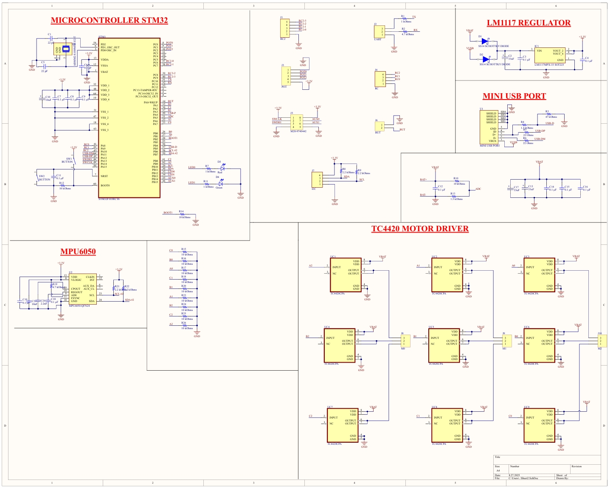
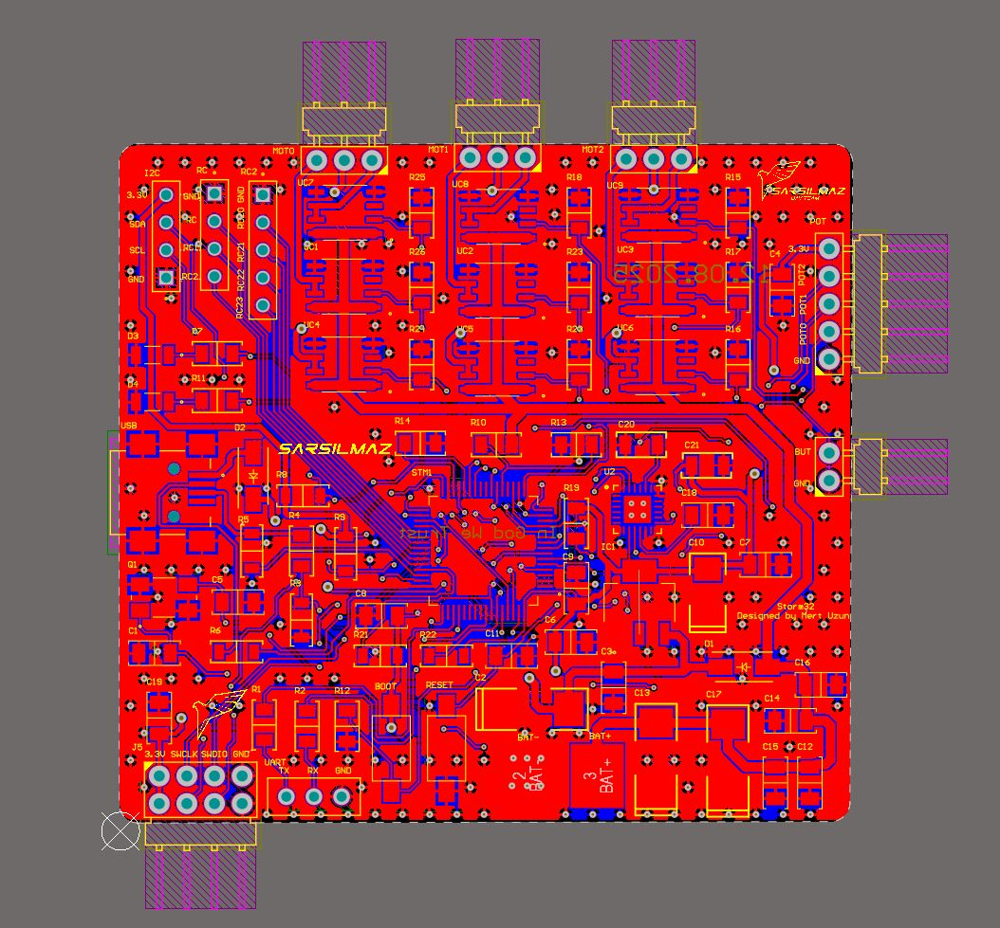
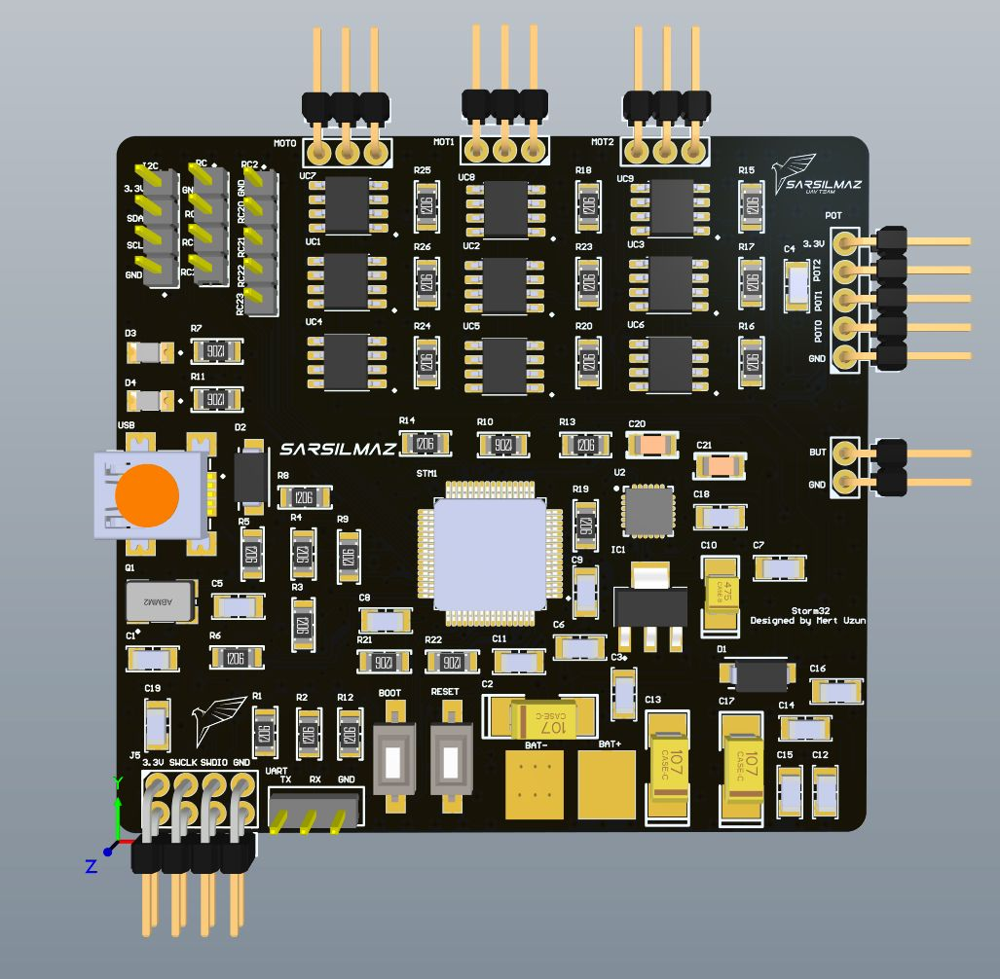
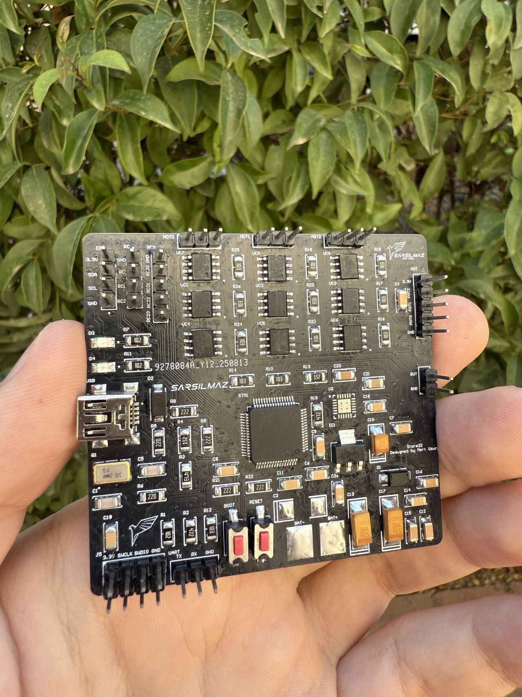
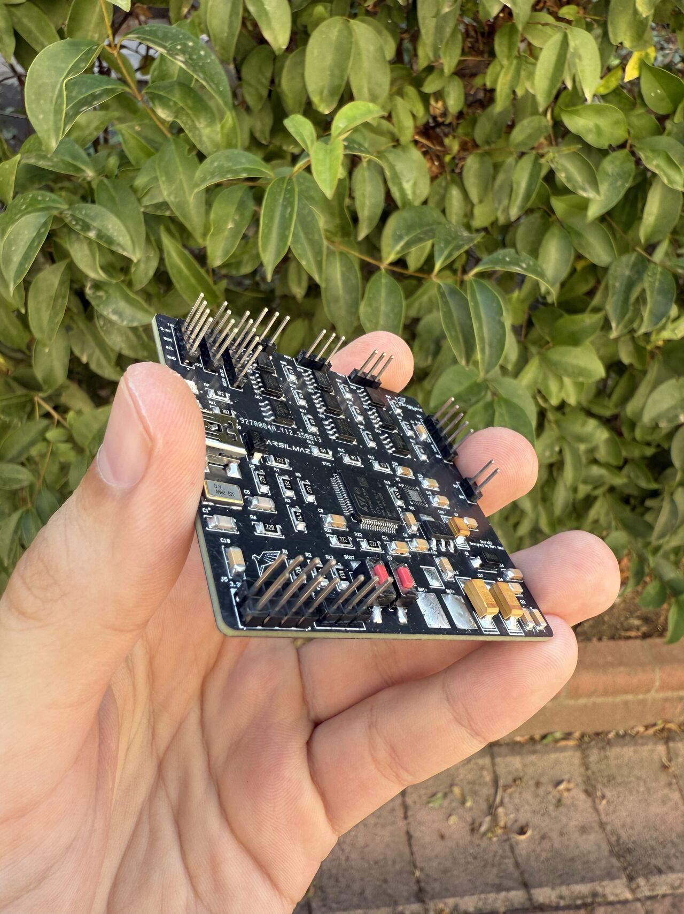

# 🎥 STM32 Tabanlı Gimbal Kontrol Kartı

*STM32F103 tabanlı, 3 eksenli gimbal motorlarını bağımsız süren kontrol kartı*

---

## 📌 Proje Hakkında

Bu kart, insansız hava araçlarındaki kamera stabilizasyonu için tasarlanmıştır. STM32F103RCT6 mikrodenetleyici üzerinde çalışan firmware, MPU6050 IMU sensöründen aldığı açısal veriyi işleyerek 3 eksendeki gimbal motorlarını TC4420CPA sürücüleri aracılığıyla bağımsız kontrol eder.

---

## ⚙️ Donanım

| Bileşen | Görev |
|--------|-------|
| STM32F103RCT6 | Ana mikrodenetleyici |
| TC4420CPA (x9) | Motor sürücü (eksen başına 3 adet) |
| MPU6050 | IMU — açısal veri okuma |
| LM1117-3.3 | Güç regülatörü |
| Mini USB | Haberleşme ve güç girişi |

---

## 🔌 Bağlantı Arayüzleri

| Konnektör | Açıklama |
|-----------|----------|
| J8 / J9 / J10 | Motor çıkışları (M0, M1, M2) |
| J3 | SWD debug portu |
| J4 | RC giriş |
| J1 | Genişletilmiş RC girişi (4 kanal) |
| J7 | I2C |
| J2 | UART |
| J5 | AUX çıkışlar |
| J6 | Buton girişi |

---

## ✨ Özellikler

- 🎯 3 eksenli bağımsız motor kontrolü
- 📐 MPU6050 ile gerçek zamanlı açısal ölçüm
- 🔋 Geniş besleme gerilimi desteği (VBAT)
- 🛠️ SWD üzerinden kolay firmware yükleme
- 💡 Durum LED'leri (Kırmızı / Yeşil)
- 📡 RC, UART ve I2C haberleşme desteği

---

## 📐 Şematik

---

## 🖼️ Görseller

### 💻 PCB Tasarımı

<table>
  <tr>
    <td align="center"><b>2D Görünüm</b></td>
    <td align="center"><b>3D Görünüm</b></td>
  </tr>
  <tr>
    <td></td>
    <td></td>
  </tr>
</table>

---

### 🏭 Üretim

<table>
  <tr>
    <td align="center"><b>Kart - Ön</b></td>
    <td align="center"><b>Kart - Arka</b></td>
  </tr>
  <tr>
    <td></td>
    <td></td>
  </tr>
</table>

---

**Mert Uzun** • Kocaeli Üniversitesi • Elektronik ve Haberleşme Mühendisliği

